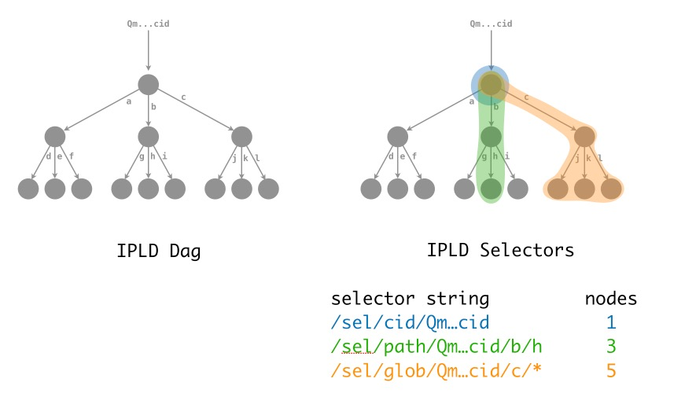

# IPLD Selectors

This document is a designdoc for IPLD Selectors.

## [Meta: Status of this doc]

- This was written around 2018-10-16 ([video presentation](https://drive.google.com/file/d/1NbbVxZQFKXwW6mdodxgTaftsI8eID-c1/view))
- It narrows down the decision space enough to make significant progress.
- good enough for trying out an implementation to learn more and make choices.
- But it is not complete.
- some choices that need to be made:
  - [ ] select general binary and string format structure for selectors. (options given here)
  - [ ] binary and string formats for each selector. doesn't have to be here.
  - [ ] whether to dump all selector codes into multicodec table, or one code.
  - [ ] which S expression selector variant to use (may be out of scope for this doc)
- more prose here may help implementors.

## Motivation - what are Selectors?

*Prerequisites: [IPLD](https://github.com/ipld/ipld), IPLD data model, [CID](https://github.com/ipld/cid).*

IPLD Selectors are expressions that identify ("select") a subset of nodes in an IPLD dag.

This is a useful primitive to use along with: (a) systems that require distributing or pinning dags (IPFS, Filecoin, bitswap, graphsync, ipfs-cluster), (b) applications that require fetching subsets of data in specific orders or at specific times (video players, dataset viewers, file systems), (c) programs that transform graphs into other graphs (data transformations, ETL, etc). In short, it is a fundamental primitive required by most systems and applications in the IPLD and IPFS ecosystems, as important as [multihash](https://github.com/multiformats/multihash), [CIDs](https://github.com/ipld/cid), [IPLD Formats](https://github.com/ipld/), and more.



## Prior Work

There have been a lot of articulations about selectors in the history of the IPFS and IPLD projects. Many documents exist extolling all the kinds of use cases for selectors. Instead of giving a complete articulation here, this document will mention a few use cases and link to the other documents.

- [Designing IPLD Selectors (2017)](https://github.com/ipld/specs/issues/35)
- [IPLD Selector Thoughts (2017)](https://github.com/ipfs/notes/issues/272)
- [exprimental js-ipld-selector (2017)](https://github.com/ipld/js-ipld-selector)
- [Designing IPLD Selectors - Workshop (2016)](https://github.com/ipfs/2016-IPFS-Workshop-Lisbon/issues/5) (+ [notes](https://github.com/ipld/specs/issues/4))
- [IPLD Selector (original issue) (2015)](https://github.com/ipfs/notes/issues/12)

### Important Design Notes

**Learn from the best.** There have been dozens of graph selector systems implemented over the last few decades. There have been only a few that have been extremely successful, and productive. Study and learn from these systems. These include: unix globs, regular expressions, XPath, css selectors, and more.

**Selectors include paths to the root.** In most cases using IPLD Selectors, programs need to be able to verify authenticated data structures (they need to hash all the nodes in a path, all the way to the root). Therefore, for all these distributed, authenticated use cases, it is drastically easier to count on Selectors that yield a result that is verifiable (checkable against the original query -- the root).

**Self-describe and use multiple types.** Over the years, there has been much designing, without arriving at a complete, perfect solution. We have now recognized this as a feature where self-description and upgradability fit better than forcing a single language: there should just be many types of selectors and applications should use the ones that fit their needs. Due to the wide variety of use cases, we will not have a single perfect syntax. This will become easier over time, as systems that use IPLD acquire the ability to execute authenticated code.

**Aim for succinct, intuitive, human-readable, expressive power.** The most successful selector systems (unix globs, regular expressions, css selectors, etc.) have created very poweful and succinct expressions, that balance the nuance between making something human-friendly and highly efficient. Understandability, intuitiveness, expressivity, familiarity, and similar qualities are desired in the human-readable syntax. Self-description and types make this drastically easier, enabling whole new types to be made over time as better and better syntaxes are discovered, and even existing familiar syntaxes to be ported over.

**Aim for succinct, efficient, self-describing binary representations.** Various systems that use IPLD Selectors may need to distribute and store billions of selectors. Succinctness of expression is key. Self-description and types make this drastically easier, enabling whole new types to be made over time as more efficient syntaxes are discovered.

**Blocks have CIDs. IPLD Nodes have Paths.** It is very important that we align on the following two statements: (1) Blocks have CIDs. (2) IPLD Nodes have paths, not CIDs. This is important because it means that IPLD nodes may begin within the middle of a block, and may not be addressable directly by a CID. This is a key realization, as Selectors must always support Paths as a dag root, not just a CID.

## IPLD Selector System

### Narrowing down the problem

The problem of IPLD Selectors is narrowed down to a very concrete, simple problem:

> - How can we succinctly identify a dag subset, connected to the root?

These other questions are solved in other systems, above or below IPLD Selectors:

> - How can we represent arbitrary data structures or files in dags? (IPLD data model, user code)
> - How can we succinctly identify a dag subset, <u>not connected to the root</u> (User code on top of IPLD selectors)
> - How can we traverse a dag subset? (IPLD library implementations, using IPLD Selectors)
> - How can we make subset selection efficient? (IPLD library implementations)
> - How can we make selector combination efficient? (IPLD library implementations)
> - How can we strip a dag subset from links to objects not in the subset (IPLD Transformations, user code)
> - How can we convert one dag representation into another? (IPLD Transformations, user code)
> - How can we agree with multiple other parties who will pin or send subsets of a dag? (ipfs-cluster, graphsync)

With our problem narrowed down, we can focus on solving just that, and let all other concerns be solved elsewhere in the stack.

### Selector Requirements

- P0 - Selectors can express any valid dag subset (connected to the root).
- P0 - Selectors can select based on IPLD paths.
- P1 - Selectors can select based on values.
- P2 - Selectors can select with seeded pseudorandomness.
- P3 - Selectors can select based on sibling nodes (as in css3) and their descendants (as in css4).
- P1 - Selectors can be composed.
- P0 - Once written, selectors should work permanently. (selector code should not change under the users).
- P1 - Selector languages can evolve and improve over time (faster than other selector systems).
- P3 - Allow experimentation without requiring backward-compatible syntax (different from globs and css).
- P0 - There is a 1-1 mapping between human readable and binary syntaxes.
- P0 - Binary syntax is self-described, succinct, and efficient.
- P0 - Human readable syntax is powerful and expressive.
- P1 - Human readable syntax is intuitive and familiar.

Some of these may seem mutually exclusive. They are not.

## Approach: Selector Types

The requirements stated above are hard to meet. We have spent lots of time in the last few years trying to reconcile them into one language and syntax, with no success. Earlier this year (2018) we recognized that the solution to this problem should be flexibility and interoperability: let many selector languages and syntaxes flourish, and let them evolve over time. This would allow us to satisfy all constraints above, including both a permanent model that can also improve over time. And it reduces the core of our system into three components:

- (1) A system of selector types, that allows creating new selector languages and syntaxes, and can compose them.
- (2) An easy path for plugging selector types into IPLD libraries and other consumers of IPLD Selectors.
- (3) A light process for testing and admitting new selector types into standard IPLD libraries.

These components imply or expand into the following things:

- Well-defined binary and human-readable type self-description (codes in multicodec).
- A narrow `Selector` interface for most uses of selectors, agnostic to selector type.
- A standard way to add selector type implementations to IPLD libraries
- IPLD libraries that pervasively uses the abstract  `Selector` type, and can plug in concrete types.
- A few simple selector types that cover most common cases (cid, path, glob, ...)
- A selector type to allow composing selectors (MultiSelector)
- Aim for language independent implementations of selector implementations (parsers, execution, etc). (WASM?)
- Allow language-specific implementations of selectors (parsers, execution, etc).
- (IMPORTANT) Well-designed set of test vectors representing a variety of use cases for IPLD Selectors.
- A recommended structure for implementing a selector type, with an easy to use test suite.


Selector types
--------------

### Fields Selector

Selects each of a set of path segments.

(If only a single path segment is specified, this can be called a "Path Selector", but it's the same thing.)


### Path Selector

Selects a single path segment.

Path selectors are a common pattern of usage, but not a specific feature in the selector spec --
it's a degenerate case of a Fields Selector which happens to select only a single field.


### All Selector

Selects every field or index in a map or list.


### Range Selector

Selects a slice or single item of a list of items.


### Recursive Selector

Uses another Selector to select things recursively. It also takes a limit on how often this recursion should happen (the limit can be set to "infinity" to keep traversing until there are no matching paths left.

The recursion may also be stopped by a given CID.


### CID Selector

There is no CID selector.  Asking for a specific CID doesn't involve any traversal; it's just asking for a node itself.  No selectors are necessary to ask for data by CID.


Use cases
---------

### Deeply nested path

In some DAG you want to get one specific value you know the path of. Let's say you want to get the birth year of a specific character of a specific show.

Example data (as JSON):

```json
{
  "show": "start-trek-voyager",
  "characters": {
    "kathryn-janeway": {
      "birthday": {
        "day": 20,
        "month": 5,
        "year": 2328
      },
      "rank": "vice admiral"
    }
  }
}
```

A Selector to extract the "year" data could look like this:

```json
{"selectFields":{"characters":
	{"selectFields":{"kathryn-janeway":
		{"selectFields":{"birthday":
			{"selectFields":{"year":
				true}}}}}}}}
```


### Getting a certain number of parent blocks in a blockchain

You want to get a certain number of parents from a certain block.

The shape of a block could look like this (in JSON):

```json
{
  "parent": "parentcid",
  "time": 1549641260,
  "none": 3423545
}
```

If you know you want five parents you could use Path Selectors:

```json
{"selectFields":{"parent":
	{"selectFields":{"parent":
		{"selectFields":{"parent":
			{"selectFields":{"parent":
				{"selectFields":{"parent":
					true}}}}}}}}}}
```

This selector matches the fivth-deepest "parent" (and in the context of
graphsync or other merkleproof applications, will yield all five nodes).

But this gets a bit verbose.  We can explore the same tree in a similar
pattern with another mechanism -- recursive exploration:

```json
{"selectRecursive": {
  "depthLimit": 5,
  "next":
    {"selectFields":{"parent":
      true}}
}}
```

This will traverse the same set of nodes as the previous example -- however,
it has has a *slightly* different effect!

Using a recursive selector in this way matches *each* of the "parent" nodes,
up to the depth limit -- meaning it matches five nodes, instead of the
previous example, which matches only the last one.

In terms of graphsync or other merkleproof applications, the selector will yield
the same set, since the set of nodes *considered* for matches is the same as
in the previous example.


### Getting changes up to a certain one

This use case is inspired by CRDTs, where you have a chain of changes. You observe a new change and want to get all the previous changes up to the one that you have already observed. It is a recursive query with a CID as stopping condition.

The shape of a change could look like this (in JSON):

```json
{
  "prev": "prevcid",
  "timestamp": 1549641260,
  "value": "abc"
}
```

It will be a Recursive Selector following along until it reaches a link of a
certain value (`somecid` in this case):

```json
{"selectRecursive": {
  "depthLimit": 5,
  "next":
    {"selectFields":{"parent":
      true}},
  "cidLimit": "somecid"
}}
```


### Getting a full sub-DAG

For getting a full file from UnixFSv1 you need to retrieve a full sub-DAG.

An example selector to get the full sub-DAG rooted at a certain CID:


```json
{"selectRecursive": {
  "next":
    {"selectFields":{"Links":
      {"selectAll":
        {"selectFields":{"multihash":
          true}}}}}
}}
```

If it's a file in some directory, you can also start at a deeper level:

```json
{"selectFields":{"with":
  {"selectFields":{"some":
    {"selectFields":{"subdirectory":
      {"selectRecursive": {
        "next":
          {"selectFields":{"Links":
            {"selectAll":
              {"selectFields":{"multihash":
                true}}}}}
      }}
}}}}}}
```

IPLD Schema
-----------

```ipldsch
# SelectorComplex is a grouping for most of the selectors, and is really just
#  a helper for the Selector type, which introduces one more important selector
#   to the group, but uses a different union representation to do so (for the
#    sake of overall serial terseness).
type SelectorComplex union {
	| SelectAll "a"
	| SelectFields "f" # n.b. "SelectPath" no longer exists: is a degenerate case of SelectFields.
	| SelectIndex "i"
	| SelectRange "r"
	| SelectRecursive "A"
	| SelectUnion "u"
} representation keyed

type Selector union {
	| SelectorComplex map
	| SelectTrue bool
} representation kinded

# SelectTrue is a terminal selector which will not explore any more fields,
# and marks the node it's applied to as a match.
type SelectTrue bool

# SelectAll considers all members of the data; think of it as similar to `./*`.
type SelectAll struct {
	next Selector (alias ":")
}

# SelectFields will explore each of the fields listed, and yields a distinct
# selector for continuing to explore and match on each reached node.
type SelectFields map {String:Selector}

# SelectIndex considers a specific item in a list by its offset.
type SelectIndex struct {
	index Int (alias "i")
	next Selector (alias ":")
}

# SelectRange considers each of the items in a range of positions in a list.
type SelectRange struct {
	start Int (alias "^")
	end Int (alias "$")
	next Selector (alias ":")
}

# SelectRecursive applies a selector to this node, then in addition traverses
# to any nodes matched and applies itself again to that node.  A depth counter
# is decremented with each recursion to ensure the process terminates.
type SelectRecursive struct {
	depthLimit Int (alias "d")
	next Selector (alias ":")
	cidLimit Link
}

# SelectUnion is a union of other selectors: if any of the selectors says
# a node matches, it matches; and if any of the selectors return a selector
# for a pathsegment, it'll be used; and if more than one selector returns
# a selector for a pathsegment, a new union selector will be implicitly
# generated during evaluation to carry all of them through.
type SelectUnion list [Selector]
```
