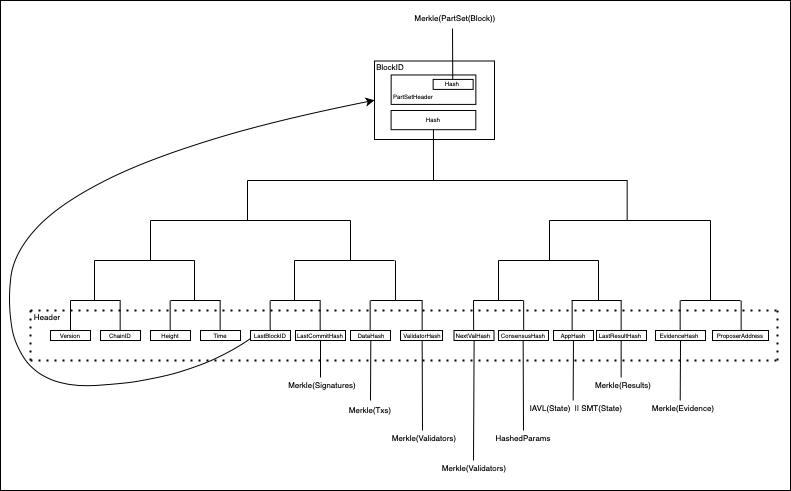

# Cosmos as an IPLD Data Structure

Tendermint and Cosmos can be read and accessed as IPLD data.

Within these documents, schemas are grouped by their serialized blocks.
Other than those types listed in "Basic Types" and "Crypto Types", each grouping of schema types in a code block represents a data structure that is serialized into a single IPLD block with its own Link (CID).

This includes both schemas for the Tendermint blockchain and CosmosSDK state machines.

For more information about the IPLD Schema language, see the [IPLD Schema documentation](/docs/schemas/).

## Data Structure Descriptions

* [Tendermint and Cosmos Data Structure **Basic Types**](./basic_types)
* [Tendermint and Cosmos **Cryptographic Types**](./crypto_types)
* [**Tendermint Chain** Data Structures](./tendermint_chain)
* [**Cosmos State** Machine Data Structures](./cosmos_state)

## Data Structure Diagram
