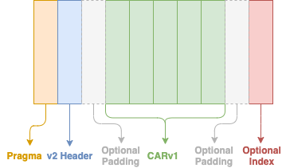

# Specification: Content Addressable aRchives (CAR / .car) v2

**Status: Draft**

* [Summary](#summary)
* [Format Description](#format-description)
  * [Pragma](#pragma)
  * [Header](#header)
  * [Characteristics](#characteristics)
  * [CARv1 data payload](#carv1-data-payload)
  * [Index payload](#index-payload)
  * [Index format](#index-format)
    * [Format `0x0400`: IndexSorted](#format-0x0400-indexsorted)
    * [Format `0x0401`: MultihashIndexSorted](#format-0x0401-multihashindexsorted)
* [Implementations](#implementations)
* [Test Fixtures](#test-fixtures)

## Summary

CARv2 is a minimal upgrade to the [CARv1](../carv1/) format with the primary aim of adding an optional index within the format for fast random-access to blocks.

CARv2 makes use of CARv1 by wrapping a properly formed CARv1 with a prefix containing a pragma and header, and a suffix containing the optional index data. Once the offset and length of the CARv1 bytes are determined using CARv2 parsing rules. Though not necessarily ideal, an existing CARv1 decoder could be used to read the roots and `CID:Bytes` pairs. Likewise, a CARv1 encoder could be be used to encode this data for wrapping by a CARv2 encoder as the payload is the same format.

## Format Description

CARv2 consists of:

1. An 11-byte pragma that identify the data as a CARv2 format.
2. A header describing some characteristics of the CARv2 as well as the locations of the data payload and index payload within the CARv2.
3. A standard CARv1 data payload, including standard CARv1 header and roots and sequence of `CID:Bytes` pairs.
4. An optional index payload, which may be one of a number of supported index formats, allowing for fast lookups of blocks within the data payload.

The CARv2 format can be illustrated as follows:



```
| 11-byte fixed pragma | 40-byte header | optional padding | CARv1 data payload | optional padding | optional index payload |
```

### Pragma

The CARv2 version pragma (or ["magic bytes"](https://en.wikipedia.org/wiki/List_of_file_signatures)) was chosen for compatibility with existing CARv1 parsers. CARv1 leads with a [DAG-CBOR](../../../codecs/dag-cbor/) block, prefixed with a varint where the block contains the version and roots array:

```ipldsch
type CarV1Header struct {
  version Int # 1
  roots [&Any]
}
```

To introduce a new version that existing parsers can safely reject as an *"unsupported version"* we must copy the minimal form of this header with a new version.

Therefore, the CARv2 pragma is a fixed sequence of 11 bytes: **`0x0aa16776657273696f6e02`**.

These bytes decode as follows: A leading `0x0a` which translates as a `uint(10)` (or `varint(10)`) indicating the length of the DAG-CBOR header block to follow. The remaining 10 bytes are a standard CBOR encoding of a map containing a `"version"` field with a value `2`. i.e.


```ipldsch
type CarV2Pragma struct {
  version Int # 2
}
```

The 10 bytes are parsed in CBOR as follows:

```
a1                                                # map(1)
  67                                              #   string(7)
    76657273696f6e                                #     "version"
  02                                              #   uint(2)
```

Existing CARv1 parsers should safely read this pragma and reject the byte stream as an unsupported version of the CAR format.

This 11 byte string remains fixed and may be matched using a simple byte comparison and does not require a varint or CBOR decode since it does not vary for the CARv2 format.

### Header

Following the 11 byte pragma, the CARv2 header is a fixed-length sequence of 40 bytes, broken into the following sections:

1. **Characteristics**: A 128-bit (16-byte) bitfield used to describe certain features of the enclosed data.
2. **Data offset**: A 64-bit (8-byte) unsigned little-endian integer indicating the byte-offset from the beginning of the CARv2 pragma to the first byte of the CARv1 data payload.
3. **Data size**: A 64-bit (8-byte) unsigned little-endian integer indicating the byte-length of the CARv1 data payload.
4. **Index offset**: A 64-bit (8-byte) unsigned little-endian integer indicating the byte-offset from the beginning of the CARv2 pragma to the first byte of the index payload. This value may be `0` to indicate the absence of index data.

### Characteristics

The characteristics bitfield contained within the CARv2 header may be used to indicate certain features of the specific CARv2. All bits in the bitfield will be unset (`0`) by default and only set (`1`) where they are being used to signal a characteristic other than the default.

The first (i.e. left-most bit) value in characteristics bitfield specifies whether the index represents a full catalog of sections that appear in data payload, referred to as `fully-indexed` characteristic. When this characteristic is set (`1`), the index must include a complete catalog of the section CIDs regardless of whether they are identity CIDs or not.

The reminder of characteristics bitfield is not used and should have all bits unset (`0`). Future iterations of this specification may introduce characteristic indicators for features such as:

* DAG walk ordering—none, depth-first, breadth-first, or via [IPLD Selector](../../../selectors/).
* De-duplication status

### CARv1 data payload

The CARv1 data payload starts at the "Data offset" indicated by the CARv2 header. It is important that a decoder adhere to this offset rather than assuming the data payload begins immediately after the header in order to make allowance for additional data following the header as indicated by the characteristics field in future amendments to this specification.

The CARv1 data payload ends after the number of bytes indicated by the "Data size" field in the header. This is important as the CARv1 parser has no means to determine extent other than encountering the end of a byte stream. Therefore, a CARv2 decoder may defer to a CARv1 decoder to load the `CID:Bytes` sequence payload and "roots" array, but must be able to deliver it a byte stream that strictly begins at "Data offset" and ends after "Data size" bytes from that offset.

The data payload is a complete, self-contained CARv1. As such, it must include a valid CARv1 header, including a roots array and a `version` field with a value strictly of `1`, followed by a series of data blocks. As such, conversion from a CARv2 to CARv1 simply requires extraction of the data payload without further modification.

Refer to the [CARv1 Specification](../carv1/) for details on the CARv1 format.

### Index payload

The CARv2 index payload follows the CARv1 data payload, but may be offset by padding or additional data as dictated by the characteristics field. If an index is present, the index payload begins at "Index offset", which _must_ be after the end of the CARv2 data payload, and continues until the end of the CARv2 byte stream (its length is not encoded in the header).

An "Index offset" value of `0` in the CARv2 header indicates that there is no index in this CARv2 and no attempt should be made to read it.

### Index format

The CARv2 index is a flexible format itself, allowing for different index layouts depending on suitability for a particular application or set of data - generation speed, usage performance, size, etc. Supported index formats will be detailed in this specification, below.

At present, once read from a CARv2, the index data provides a mapping of hash digest bytes to block location in byte offset from the beginning of the CARv1 data payload (_not_ the begining of the CARv2). The index only uses the hash digest—it does not use the full bytes of a CID, nor does it use any of the multihash prefix bytes. Future index formats may introduce alternative mapping schemes or additional data within the index.

The first byte(s) of a CARv2 index (at the "Index offset" position) contain an unsigned [LEB128](https://en.wikipedia.org/wiki/LEB128) integer ("varint") that indicates the index format type as a [Multicodec](https://github.com/multiformats/multicodec) code. The remaining bytes follow the encoding rules of that index format type.

As the index only contains the hash digest bytes, other details contained within the block's CID and the length of the block's bytes must be derived by inspecting the initial bytes of the block entry within the data payload.

Indexes **should not include identity hash CIDs unless the `fully-indexed` characteristic is set**. It is assumed that any use of a CARv2 as a blockstore will return identity CID data immediately by extracting it from the CID, therefore there should be no need to provide indexing for such entries. However, when `fully-indexed` characteristic is set, the blockstore should persist blocks with identity CID into the CARv2 data payload and index them.

#### Format `0x0400`: IndexSorted

An unsigned varint of `0x0400` at the "Index offset" byte position indicates the remaining bytes of the CAR should be interpreted as the "IndexSorted" format.

IndexSorted sorts hash digests by two dimensions: first into buckets of _digest length_, smallest to largest, and then within those buckets ordered by a simple byte-wise sorting. In this way, locating a hash digest within the CAR requires first finding the bucket matching the length of the requested hash digest, then searching the ordered list of digests within that bucket to find the matching entry.

* IndexSorted may contain one or more length-grouped buckets of digests.
* Buckets are ordered by digest length and concatenated together to form the index.
* Each bucket is prefixed with:
  * a "width" encoded as a 32-bit unsigned little-endian integer indicating the common byte length of the combination of hash digests and their offsets in this bucket; followed by
  * a "count" encoded as a 64-bit unsigned little-endian integer which determines the total number of hash digests (and their offsets) bucket.

A common case of a single bucket of 32-byte hash digests is expected due to the commonality of this digest length for CIDs.

Individual index entries are the concatenation of the hash digest an an additional 64-bit unsigned little-endian integer indicating the offset of the block from the begining of the CARv1 data payload. Offsets locate the first byte of the varint that prefix the `CID:Bytes` pair within the CARv1 payload. See the [data section in the CARv1 Specification](../carv1/#data) for details on block encoding.

For example, a bucket containing 32-byte hash digests will have a "width" of `40` as each entry in the bucket is a concatenation of the 32-byte digest and an 8-byte offset value. Hash digest length within a bucket is derived by subtracting `8` from the "width" of the bucket.

Each bucket, therefore, takes the following form:

```
| width (uint32) | count (uint64) | digest1 | digest1 offset (uint64) | digest2 | digest2 offset (uint64) ...
```

#### Format `0x0401`: MultihashIndexSorted

An unsigned varint of `0x0401` at the "Index offset" byte position indicates the remaining bytes of the CAR should be interpreted as the "MultihashIndexSorted" format.

MultihashIndexSorted builds on top of the `IndexSorted` by storing an additional dimension: the hash function by which digests are calculated, a.k.a. _multihash code_. More precisely, MultihashIndexSorted sorts hash digests by three dimensions: first into buckets of multihash code, smallest to largest, then into buckets of _digest length_, smallest to largest, and finally within those buckets ordered by a simple byte-wise sorting. In this way, locating a multihash within the CAR requires first finding the bucket matching the code of the requested multihash, then the length of the requested multihash digest, and finally searching the ordered list of digests within that bucket to find the matching entry.

* MultihashIndexSorted may contain one or more multihash code-grouped buckets of digests.
* Multihash code-grouped buckets may further contain one or more length-grouped buckets.
* Buckets are ordered by multihash code then digest length, and concatenated together to form the index.
* Each bucket is prefixed with:
  * a "multihash code" encoded as a 64-bit unsigned little-endian integer indicating the common multihash code for the digests in this bucket; followed by
  * length-grouped bucket structure identical to IndexSorted.

Individual index entries are also identical to the IndexSorted entries. Each bucket, therefore, takes the following form:

```
| multihash-code (uint64) | width (uint32) | count (uint64) | digest1 | digest1 offset (uint64) | digest2 | digest2 offset (uint64) ...
```

## Implementations

As of writing there are two work-in-progress implementations:

* https://github.com/ipld/go-car/tree/wip-v2/v2 - a `wip-v2` branch of go-car
* https://github.com/ipld/js-car/pull/30 - a read-only implementation for js-car

## Test Fixtures

To assist implementations in confirming compliance to this specification, the following test fixtures are available:

* [carv2-basic](../fixture/carv2-basic/) - Basic CAR with linked raw and DAG-PB blocks
